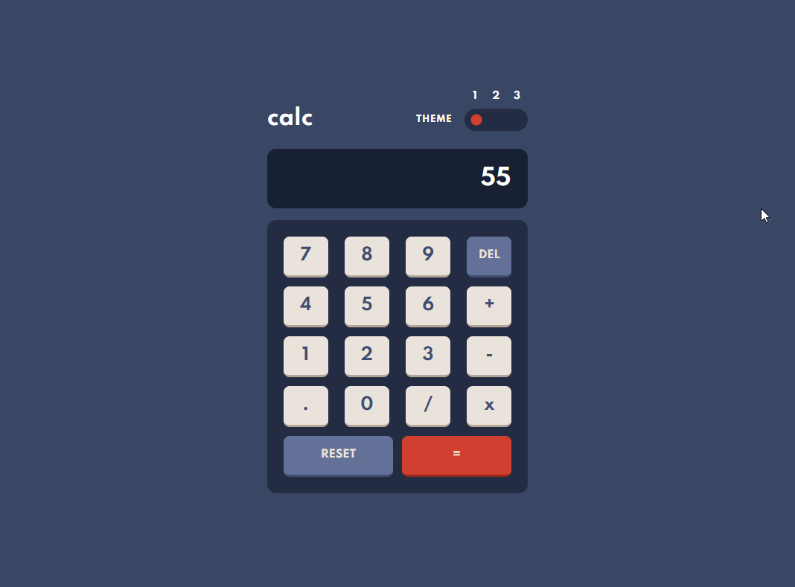
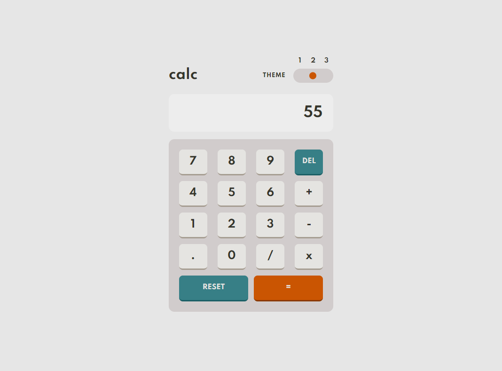
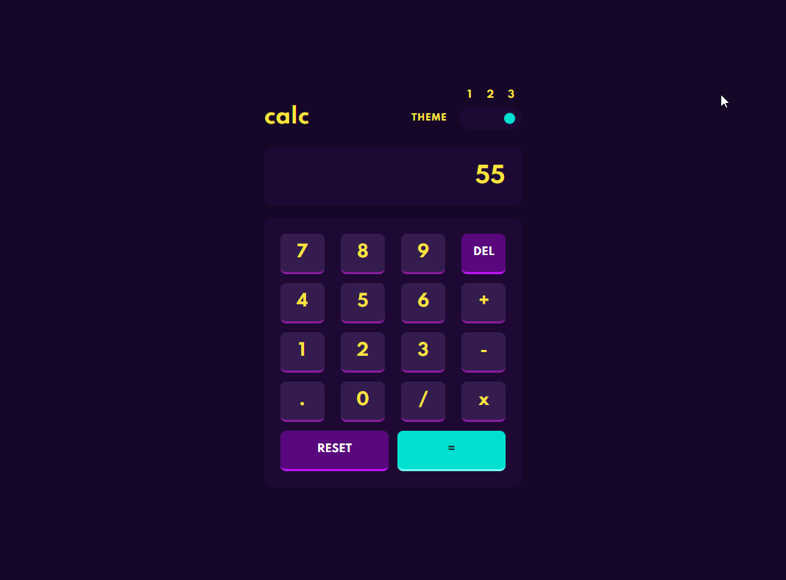

# frontend-mentor-calculator

A calculator with the +, -, *, and / operators

# Technologies
In this project I used HTML, SCSS(SASS), JS.

[This is a challenge of FrontEnd Mentor](https://www.frontendmentor.io/challenges/calculator-app-9lteq5N29).

## Result

> ### See the result live [here](https://frontend-mentor-calculator.vercel.app/)

Theme 1 -

Theme 2 -

Theme 3 -

